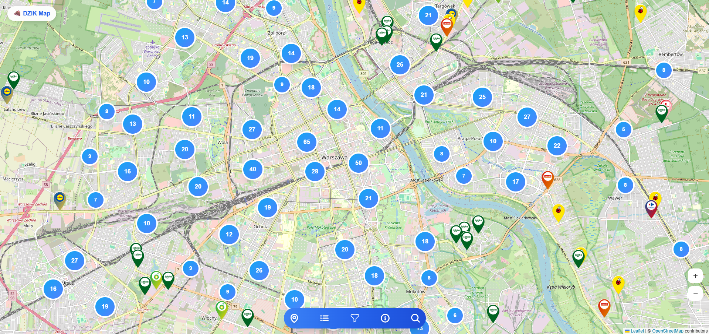
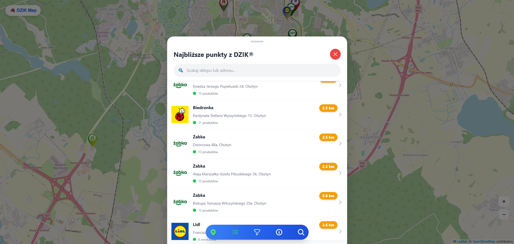
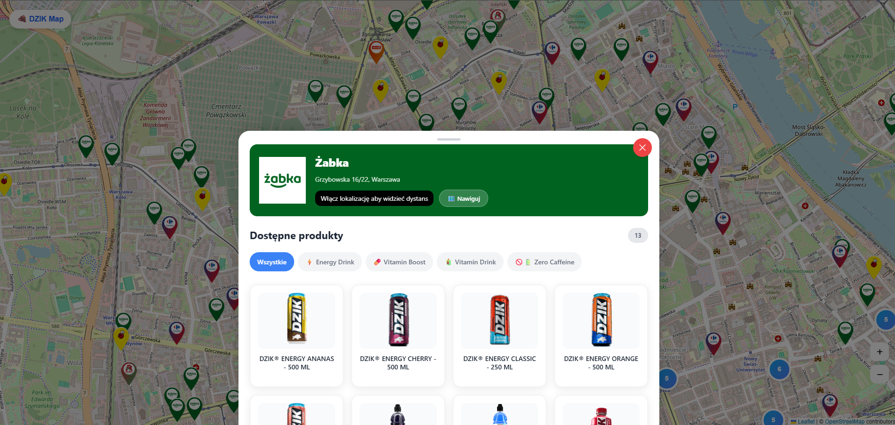
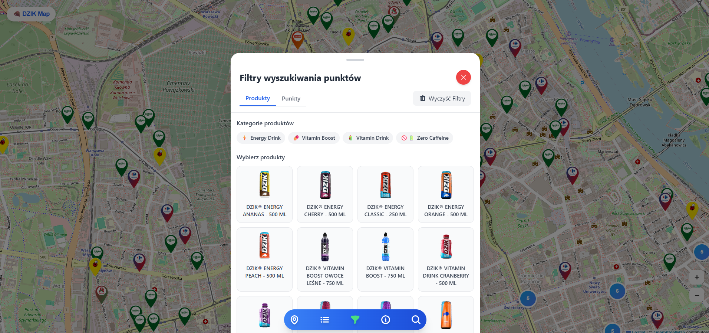
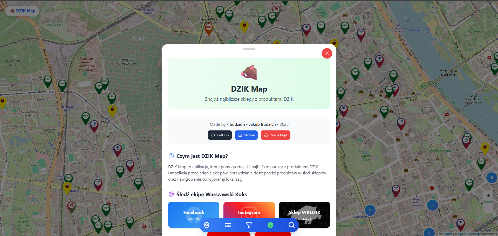

# DZIK Map

Aplikacja do wyszukiwania najbliższych sklepów z produktami DZIK® w Polsce.

## Opis projektu

DZIK Map to aplikacja webowa, która umożliwia użytkownikom lokalizowanie punktów sprzedaży napojów energetycznych i witaminowych marki DZIK. Aplikacja oferuje:

- 🗺️ Interaktywną mapę z lokalizacjami sklepów w całej Polsce
- 🔍 Wyszukiwanie najbliższych punktów sprzedaży
- 📍 Nawigację do wybranego sklepu
- 🏪 Informacje o dostępnych produktach w każdej lokalizacji
- 🔎 Filtry produktów według kategorii

## Funkcje

### Mapa sklepów

Przeglądaj setki punktów sprzedaży DZIK® na interaktywnej mapie Warszawy i okolic.

### Lista najbliższych sklepów

Znajdź najbliższe sklepy z produktami DZIK wraz z informacją o odległości i dostępnych produktach.

### Szczegóły sklepu

Sprawdź dokładną lokalizację, dostępne produkty i nawiguj bezpośrednio do wybranego sklepu.

### Filtry produktów

Filtruj sklepy według dostępnych kategorii produktów:
- ⚡ Energy Drink
- 💪 Vitamin Boost
- 🥤 Vitamin Drink
- 🚫☕ Zero Caffeine

### Informacje o aplikacji

## Technologie

- **Frontend**: React + TypeScript + Tailwind CSS  
- **Backend**: Python Django + PostgreSQL 
- **Mapa i dane**: Leaflet + OpenStreetMap + Overpass API + Geoapify
## Autor

Stworzono przez **budziun • Jakub Budzich** w 2025 roku.

## Linki

- [GitHub](https://github.com/budziun)
- [Facebook - Warszawski Koks](https://www.facebook.com/warszawskikoks)
- [Instagram - @warszawski_koks](https://instagram.com/warszawski_koks)
- [Sklep WKDZiK](https://sklep.wkdzik.pl)

